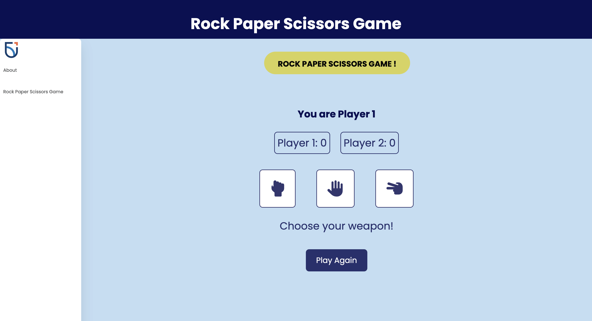
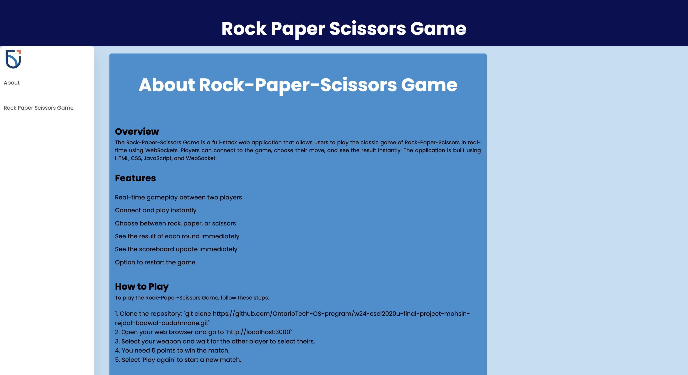

# Rock-Paper-Scissors Game with WebSockets

## Project Information

The Rock-Paper-Scissors Game is a full-stack web application that allows two users to play the classic game of Rock-Paper-Scissors in real-time using WebSockets. Players can connect to the game, choose their move, and see the result instantly. The application is built using HTML, CSS, JavaScript, and WebSocket.

### Application Images

#### Rock-Paper-Scissors Game Screenshot

#### About Page Screenshot

## How to Run

Follow these steps to run the application:

1. Open project directory as an IntelliJ IDEA project.
2. Setup GlassFish configuration with the provided URL: [http://localhost:8080/WSChatServer-1.0-SNAPSHOT/](http://localhost:8080/WSChatServer-1.0-SNAPSHOT/)
3. Run the project to open the application in your web browser
4. Select a weapon to start playing the game

## Other Resources

The following libraries and frameworks were used in this project:

- WebSocket: A protocol that enables bidirectional communication between the client and the server over a single, long-lived connection.
